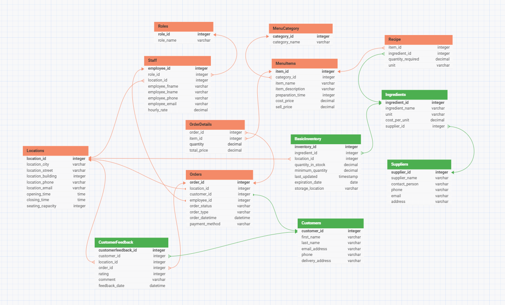

# TEAMWORK - Topic 03 (Database Design)

## Склад команди

- Команда: Team 4
- Варіант: Restaurant Management System

## Таблиця внесків

| Учасник | Роль у команді | Що зроблено | Артефакти / файли |
|---|---|---|---|
| Viktoriia Hryvniak | Database designer | Створила таблиці Customers, CustomerFeedback, Ingredients, Suppliers, BasicInventory та зв’язки між ними | ER diagram, DBML |
| Artem Rudnytskyi | Database designer | Створив таблиці Locations, Roles, Staff, MenuCategory, MenuItems, Orders, OrderDetails, Recipe та зв’язки між ними | ER diagram, DBML |

## Контекст теми

Над завданням фактично працювали двоє учасників — Viktoriia Hryvniak та Artem Rudnytskyi, оскільки інші учасники не мали можливості долучитися. Тому ми розподілили таблиці між собою та трохи спростили початковий обсяг завдання.

Viktoriia відповідала за клієнтів, відгуки, інгредієнти, постачальників та запаси. Artem відповідав за локації, персонал, ролі, меню, замовлення та рецепти.

## ER-діаграма

Фінальна ER-діаграма:

Версія: **Final Version**

У фінальну ER-діаграму інтегровані такі таблиці:

- Locations
- Roles
- Staff
- MenuCategory
- MenuItems
- Orders
- OrderDetails
- Recipe
- Customers
- CustomerFeedback
- Ingredients
- Suppliers
- BasicInventory

Основні зв’язки між таблицями:

- Staff пов’язана з Roles та Locations.
- MenuItems пов’язана з MenuCategory.
- Recipe пов’язує MenuItems та Ingredients.
- Orders пов’язана з Locations, Customers та Staff.
- OrderDetails пов’язує Orders та MenuItems.
- Ingredients пов’язана з Suppliers.
- BasicInventory пов’язана з Ingredients та Locations.
- CustomerFeedback пов’язана з Customers, Orders та Locations.

## Коротке обґрунтування вибору початкового варіанта

1. Чому команда обрала саме цей варіант:
   Ми обрали Restaurant Management System, тому що ця тема зрозуміла і добре підходить для створення реляційної бази даних з різними типами зв’язків.

2. Які навчальні цілі він покриває:
   Цей варіант дозволяє попрактикувати створення таблиць, primary key, foreign key, зв’язки між таблицями, ER-діаграму та DBML.

3. Чому він кращий для вашої команди за інші доступні варіанти:
   Цей варіант було зручно розділити на дві частини між учасниками. Навіть після спрощення ми змогли зберегти основну логіку системи та всі ключові зв’язки.
